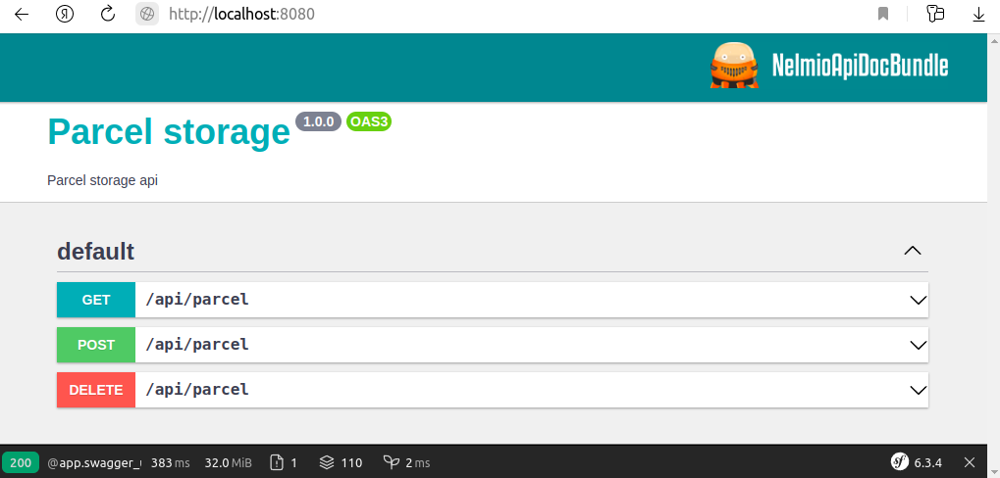

Привет, это тестовое задание на позицию стажера php-разработчика. Оно может находится в
приватном репозитории (скрытом) - чтобы все было по честному и никто не смог воспользоваться
результатами сделанной тобой работы. А еще чтобы наши кандидаты в стажеры не копипастили
друг у друга совершенно неправильные решения. 

Твой труд будет виден только тебе и нашей команде менторов. 
Добавь их: livsi, blackberryJam, smk-trainee, chunkwan

Тебе не прийдется создавать каркас приложения самостоятельно - мы уже сделали это
для тебя.

На локальной машине нужен установленный __git__,  __docker__ и __docker compose__
Если к тебя их еще нет - тебе пригодятся следующие ссылки:

- https://docs.docker.com/engine/install/
- https://docs.docker.com/engine/install/linux-postinstall/ (для линукс-пользователей)
- https://git-scm.com/downloads


Для того, чтобы разрабатывать - авторизируйся в github.com и нажми на кнопку Use this template


После этого клонируй код своего репозитория на комп и можно начинать
работу. Часть кода уже написана - ее при необходимости можно смело менять, особенно если
видишь в нем ошибки, но большую часть тебе прийдется написать самостоятельно.

Обрати внимание, что файлы для docker-compose поменяли свои названия после июня 2023
(подробнее читай тут https://docs.docker.com/compose/compose-file/03-compose-file/)
и теперь это compose.yaml - основной и compose.override.yaml - автоматически подгружаемая
пользовательская конфигурация, которая сливается с основной.

## Запуск приложения:

1. Копируй содержимое файла compose.override.yaml.dist в compose.override.yaml в
корневой папке проекта, если необходимо - поменяй порты для nginx и базы данных (возможно
они у тебя заняты другими приложениями, которые ты разрабатываешь)

```
cp compose.override.yaml.dist compose.override.yaml
```

2. Запусти подготовленное приложение:

```
docker compose up -d
```

3. Установи зависимости для php-приложения:

```
bin/composer install
или
docker compose exec php composer install
```

4. Проверь что приложение работает, для этого открой браузер и перейди по адресу http://localhost:8080/ 
(при использовании порта по умолчанию для nпinx в файле composer.override.yaml)



5. Для удобства вызова консольных команд внутри контейнера есть алиас bin/sf . 
Проверь что он также работает:

```
bin/sf list
```

## Задание

Необходимо доработать сервис хранения информации о посылках (Parcels) на PHP (Symfony). 

Сервис должен реализовывать REST API для:
1. создания посылки
2. поиск посылки по телефону отправителя
3. поиск посылки по фио получателя
3. удаления посылки

У сущности Посылка(Parcel) есть следующие свойства:
- отправитель
    - фио
    - телефон
    - адрес отправления (страна, город, улица, дом, квартира)
- получатель
    - фио
    - телефон
    - адрес получения (страна, город, улица, дом, квартира)
- габариты
    - длина
    - ширина
    - высота
    - вес
- оценочная стоимость посылки

Посылки должны сохранятся в базе данных PostgreSQL (в конфигурации compose.yaml - она уже есть).
При решении обязательно включай логику "здравого смысла" - хотелось бы увидеть не просто умение писать код,
но и способность решать задачи бизнеса.

## Что нужно сделать

1. Добавить нужные Entity (https://symfony.com/doc/current/doctrine.html#creating-an-entity-class)
2. Добавить сервис(ы) с необходимыми методами
3. В контроллеры добавить вызовы нужных методов сервисов
5. Привести в соответствие api документацию разработанному решению
6. Сделать пулл-реквест из ветки, в которой разрабатывалось решение в main ветку - чтобы ревьюверу удобно было смотреть изменения
7. Документировать реализованное решение. Описать, почему сделано именно так, и какие видел(а) альтернативные варианты, плюсы и минусы.
   Поставленная задача решается множеством способов. В описании - по возможности напиши, сколько времени в часах у тебя заняла
   работа по этому тестовому заданию.

## Будет плюсом, если реализуешь (не обязательно все)
1. Написать автотесты уровня unit (https://symfony.com/doc/current/testing.html#unit-tests) для своего решения
2. Дополнительные тесты уровня e2e
3. Изменение конфигурации для запуска xdebug + инструкцию, как настроить в PhpStorm или VsCode
4. Оценишь покрытие своего кода юнит-тестами
5. Реализуешь гитхаб-экшн с пайплайном чистоты кода и прохождения тестов
7. Makefile или Taskfile для запуска часто используемых команд
8. Напишешь, что еще можно было бы реализовать

## При проверке мы оцениваем
1. Работоспособность решения
2. Полноту документирования API
3. Правильность работы решения с точки зрения здравого смысла
4. Обработку ошибок
5. Код решения, его качество
6. Наличие и качество автотестов
